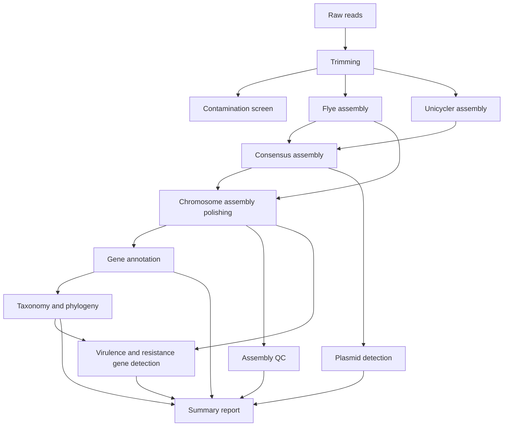

## User guide: Interpreting the pipeline's outputs



All results generated by this piipeline are saved to a directory defined by the `--outdir` parameter (default: `results` directory). The directory structure is as follows:

``` bash
ONT-BACPAC-nf
├── ${params.outdir}
    ├── assemblies
    ├── annotations
    ├── raw_qc
    ├── report
    ├── resistance_virulence_genes
    ├── taxonomy_phylogeny
    └── runInfo
```

### `raw_qc/`

Raw data quality is evaluated and improved in a series of steps. The pipeline first assesses the quality of raw reads for the whole ONT run using [NanoPlot]() and [PycoQC](). The ONT Minion machine outputs a number of zipped files that contain the raw reads in fastq format. These files are concatenated at the barcode/sample level. Adapters and  

and then assessed for quality. The pipeline then performs a series of quality control steps to remove low quality reads and adapters. The quality of the reads is then assessed again using NanoPlot and PycoQC. The pipeline will output the raw data quality control results into the `${params.outdir}/raw_qc` directory.

#### `PycoQC_output.html`

PycoQC generates interactive plots for ONT sequencing data. It relies in the `sequencing_summary.txt` file generated during the ONT run. The PycoQC output is saved as an HTML file that can be opened in a web browser. The plots show the quality of the sequencing run, including read length, read quality, and read count. 

See the [PycoQC docs](https://a-slide.github.io/pycoQC/) and this [detailed tutorial](https://timkahlke.github.io/LongRead_tutorials/QC_P.html) for details.

#### `nanoplot_summary_plots/`

NanoPlot also generates a number of plots for ONT sequencing data. It produces a number of plots and an HTML report `NanoPlot-report.html` that can be opened in a web browser. The plots show the quality of the sequencing run, including read length, read quality, read count, and sequencing speed. 

See the [NanoPlot docs](https://github.com/wdecoster/NanoPlot) for details.

### `assemblies/` 

#### Chromosome assemblies

This pipeline has implemented a hybrid assembly strategy that first generates assemblies using Flye and Unicycler, then attempts to generate a consensus assembly using both Flye and Unicycler assemblies. Generating a consensus assembly using Trycycler typically requires manual interventions, however we have automated this process using sensible default parameters. See the Trycycler [publication](https://genomebiology.biomedcentral.com/articles/10.1186/s13059-021-02483-z) and [code base](https://github.com/rrwick/Trycycler) for  information on how Trycycler generates a consensus.

Where a high quality consensus assembly cannot be generated, the pipeline will output the Flye assembly instead. Our benchmarking has shown that Flye generates more contiguous chromosomal assemblies than Unicycler. Regardless of the assembly method used, the pipeline will output polished assemblies into the `${params.outdir}/assemblies` directory. 

#### Plasmid assemblies

Plasmids are assembled using Plassembler which outputs a `_plasmids.fasta` file containing the plasmid sequences and a `_plasmids.gfa` file which contains the assembly graph that can be visualised using Bandage. 

### `annotations/` 

### `raw_qc/`

### `report/` 

### `resistance_virulence_genes/`

### `taxonomy_phylogeny/`

### `run_info/`

Nextflow automatically generates a number of reports for each run. These reports are saved in the `${params.outdir}/run_info` directory. The reports include: 

* `report.html`: A summary of the pipeline run, including the command line parameters used, the pipeline version, and the run time.
* `timeline.html`: A timeline of the pipeline run, showing the duration of each process.
* `trace.txt`: A detailed log of the pipeline run, including the command line parameters used, the pipeline version, and the run time. 

See the [Nextflow documentation](https://www.nextflow.io/docs/latest/tracing.html) for details.