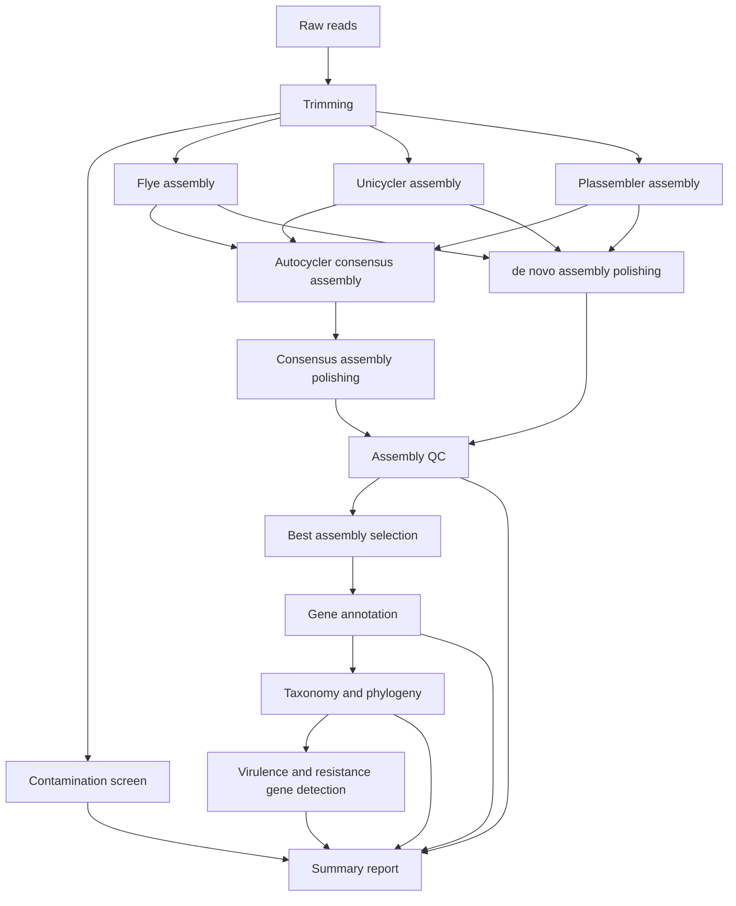

## User guide: Interpreting the pipeline's outputs



All results generated by this piipeline are saved to a directory defined by the `--outdir` parameter (default: `results`). The directory structure is as follows:

``` bash
ONT-BACPAC-nf
├── ${params.outdir}
    ├── assemblies
    ├── annotations
    ├── quality_control
    ├── report
    ├── taxonomy
    └── run_info
```

### `quality_control/`

Raw data quality is evaluated and improved in a series of steps. The pipeline first assesses the quality of raw reads for the whole ONT run using NanoPlot and PycoQC. The ONT Minion machine outputs a number of zipped files that contain the raw reads in fastq format. These files are concatenated at the barcode/sample level. 

The pipeline will output the raw data evaluation from NanoPlot and PycoQC into the `${params.outdir}/quality_control` directory as `nanoplot_summary/` and `pycoqc_summary.html`, respectively. 

#### `pycoqc_summary.html`

PycoQC generates interactive plots for ONT sequencing data. It relies in the `sequencing_summary.txt` file generated during the ONT run. The PycoQC output is saved as an HTML file that can be opened in a web browser. The plots show the quality of the sequencing run, including read length, read quality, and read count. 

See the [PycoQC docs](https://a-slide.github.io/pycoQC/) and this [detailed tutorial](https://timkahlke.github.io/LongRead_tutorials/QC_P.html) for details.

#### `nanoplot_summary/`

NanoPlot also generates a number of plots for ONT sequencing data. It produces a number of plots and an HTML report `NanoPlot-report.html` that can be opened in a web browser. The plots show the quality of the sequencing run, including read length, read quality, read count, and sequencing speed. 

See the [NanoPlot docs](https://github.com/wdecoster/NanoPlot) for details.

#### `${barcode}_kraken2/`

The pipeline uses Kraken2 to screen for contamination in the raw reads. The pipeline will output the Kraken2 results into the `${params.outdir}/quality_control` directory as `${barcode}_kraken2` directories. Each directory contains the Kraken2 [`.k2report`](https://github.com/DerrickWood/kraken2/blob/master/docs/MANUAL.markdown#output-formats) file for each barcode/sample. 

See the [Kraken2 docs](https://github.com/DerrickWood/kraken2/blob/master/docs/MANUAL.markdown#output-formats) for details.

#### `${barcode}/${barcode}_<assembly>/` - QUAST

QUAST has been used to provide a variety of metrics and visualisations to help assess the accuracy and completeness of the chromosome assemblies. QUAST will be run for each assembly of each sample. The pipeline will output the QUAST results into the `${params.outdir}/quality_control/${barcode}/${barcode}_<assembly>`, where `<assembly>` is one of `flye`, `unicycler`, or `consensus`. Each directory contains a QUAST report, a `basic_stats/` folder and various other files. 

See the [QUAST docs](https://quast.sourceforge.net/docs/manual.html#sec3) for details. 

#### `${barcode}/${barcode}_<assembly>_busco/` - BUSCO

BUSCO reports the completeness of the genome based on the presence of Benchmarking Universal Single-Copy Orthologs (BUSCOs). The pipeline will output the BUSCO results into `${params.outdir}/quality_control/${barcode}/${barcode}_<assembly>_busco`. Each directory contains a BUSCO summary file.  

See the [BUSCO docs](https://busco.ezlab.org/busco_userguide.html#interpreting-the-results) for details. 

### `assemblies/` 

#### Chromosome assemblies

This pipeline has implemented a hybrid assembly strategy that first generates assemblies using Flye and Unicycler, then attempts to generate a consensus assembly using both Flye and Unicycler assemblies. This consensus assembly is generated using [Autocycler](https://github.com/rrwick/Autocycler). For more information on this tool, see the Autocycler [publication](https://doi.org/10.1101/2025.05.12.653612) and [code base](https://github.com/rrwick/Autocycler) for information on how it generates consensus sequences.

Where a high quality consensus assembly cannot be generated, the pipeline will determine the most complete de novo assembly based on its BUSCO results and use that assembly instead. Regardless of the assembly method used, the pipeline will output polished assemblies into the `${params.outdir}/assemblies` directory. Polished assemblies that passed consensus approach will be saved to `${barcode}_consensus/` and assemblies that failed the consensus approach will be saved to `${barcode}_<assembler_name>/`. 

Autocycler and Flye output different files, assembly fastas are output assemblies as `${barcode}_consensus/consensus.fasta` or `${barcode}_flye/${barcode}_polished/consensus.fasta`, respectively. 

#### Plasmid assemblies

Plasmids are assembled using Plassembler which outputs a `_plasmids.fasta` file containing the plasmid sequences and a `_plasmids.gfa` file which contains the assembly graph that can be visualised using Bandage. For samples where plasmids are not detected, there will be no plasmid output directory. Plasmid assemblies will be saved to `${barcode}_plassembler/plassembler_plasmids.fasta`. 

See the [Plassembler docs](https://github.com/gbouras13/plassembler?tab=readme-ov-file#outputs) for details.

### `annotations/` 

Output in this directory relates to assembly features and quality evaluation. Annotations have been organised according to their sample ID, `${barcode}`. Within each sample directory is a number of subdirectories: `abricate`, `amrfinderplus`, `bakta/`. and `plasmids/`. 

#### Gene annotations (`bakta/`)

Bakta has been used to annotate the chromosome assemblies in this pipeline. Bakta annotation results are output into `${params.outdir}/annotations/${barcode}_${assembler}/bakta`. Each directory contains the Prokka annotation files for each barcode/sample. Bakta outputs a number of files, including a `.gff` file containing genome sequence annotations, a `.tsv` file containing a summary of gene features identified, and a `.faa` file that contains the protein sequences. 

See the [Bakta docs](https://github.com/oschwengers/bakta?tab=readme-ov-file#output) for details. 

#### Antimicrobial resistance genes (`amrfinderplus/`)

The pipeline uses AMRFinderPlus to detect antimicrobial resistance (AMR) genes in the assemblies. The pipeline will output the AMRFinderPlus results into `${params.outdir}/annotations/${barcode}_${assembler}/amrfinderplus`. Each directory contains an AMRFinderPlus annotation text file. Samples without AMR genes will have an empty `${barcode}.txt` file.

#### Virulence genes (`abricate/`)

The pipeline uses Abricate to detect virulence genes in the assemblies. The pipeline will output the Abricate results into `${params.outdir}/annotations/${barcode}_${assembler}/abricate`. Each directory contains an Abricate annotation text file. Samples without virulence genes will have an empty `${barcode}.txt` file.

#### Plasmid annotations (`plasmids/`)

Bakta has been used to annotate the plasmid assemblies in this pipeline. Bakta annotation results are output into `${params.outdir}/annotations/${barcode}/plasmids`. Each directory contains the Prokka annotation files for each barcode/sample. Bakta outputs a number of files, including a `.gff` file containing genome sequence annotations, a `.tsv` file containing a summary of gene features identified, and a `.faa` file that contains the protein sequences. 

### `report/` 

This pipeline uses MultiQC to aggregate stats and summaries for various steps of the pipeline. The pipeline will output two MultiQC reports, both of which can be opened in a web browser.

The first report summarises the sequencing and assembly quality control metrics, and will be located at `${params.outdir}/results/report/qc_report/multiqc_report.html`. It includes data from PycoQC and NanoStat about the sequencing run, as well as QUAST and BUSCO metrics for each of the assemblies and (if used) metrics specific to Autocycler's consensus assembly.

The second report summarises the results of the pipeline, including the results from Kraken and Bakta, and the phylogenetic tree and AMR/virulence gene findings. This will be loacted at `${params.outdir}/results/report/analysis_report/multiqc_report.html`.

### `taxonomy/`

This directory contains custom generated outputs for the phylogenetic tree.  

### `run_info/`

Nextflow automatically generates a number of reports for each run. These reports are saved in the `${params.outdir}/run_info` directory. The reports include: 

* `report.html`: A summary of the pipeline run, including the command line parameters used, the pipeline version, and the run time.
* `timeline.html`: A timeline of the pipeline run, showing the duration of each process.
* `trace.txt`: A detailed log of the pipeline run, including the command line parameters used, the pipeline version, and the run time. 

See the [Nextflow documentation](https://www.nextflow.io/docs/latest/tracing.html) for details.
